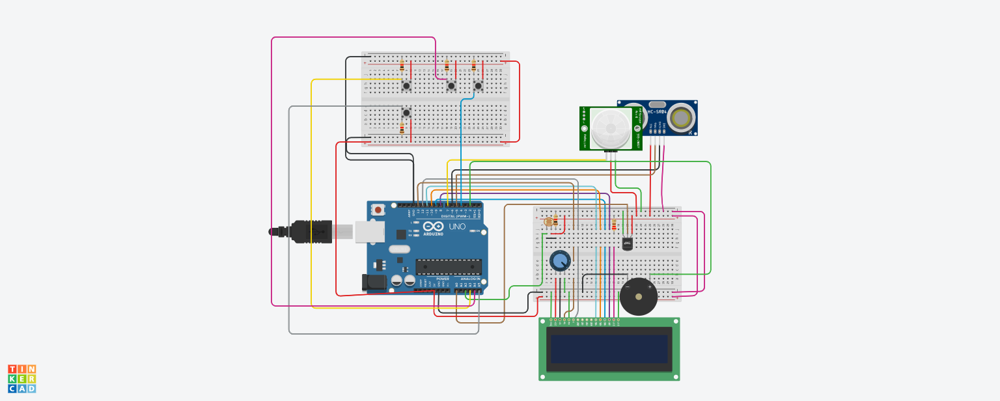

<h3 align="center">Smart_Healthcare_IoT_based_Environment.</h3> 

    A Patient Helat Monitoring Systems designed with IoT Systems
     
     
    <a href="https://www.tinkercad.com/things/2uoqGiNoDGG-copy-of-smart-health-monitoring-system-mandiproject/editel?sharecode=aS7A3MhqMH9NHqq5BsHDIhsB-xyrxhdzcLJeucD9kfM">View Demo</a>
    ·
    <a href="https://github.com/abhiramgorle/SmartHealthcare-IoT-Project/issues">Report Bug</a>
    ·
    <a href="https://github.com/abhiramgorle/SmartHealthcare-IoT-Project/issues">Request Feature</a>
  

 
## About The Project

This project's main idea is to develop an easily accessible solution for monitoring human vitals and portraying the same in a user-friendly manner.

## Development_Circuit :

## Schematic Diagram of the image :

### Built With

The complete system is built with usinf CPP language.
<!-- MARKDOWN LINKS & IMAGES -->
<!-- https://www.markdownguide.org/basic-syntax/#reference-style-links -->
[React.js]: https://img.shields.io/badge/C++-blue.svg?style=flat&logo=c%2B%2B
[React-url]: https://isocpp.org/
* [![React][React.js]][React-url]

<!-- GETTING STARTED -->

### Prerequisites

You need to have a account in Autodesk or Tinkercad to create your own systems.
## Installation and Getting Started

1. Go to the demo website given in the link.
2. Go to the settings menu in the website.
3. Click on dublicate.
4. There you go you have your own IoT system.You can make any changes you want to modify it.

<!-- CONTACT -->
## Contact

Abhiram Gorle - dgorle@gitam.in

Project Link: [Project](https://github.com/abhiramgorle/SmartHealthcare-IoT-Project)

<!-- ACKNOWLEDGMENTS -->
## Acknowledgments

1. I want to acknowledge both my frinds that has worked alongside with me Durga Sritha and Risitha Kakarlapudi.
2. I am thankful for my mentor Dr.Patnana Naresh.
